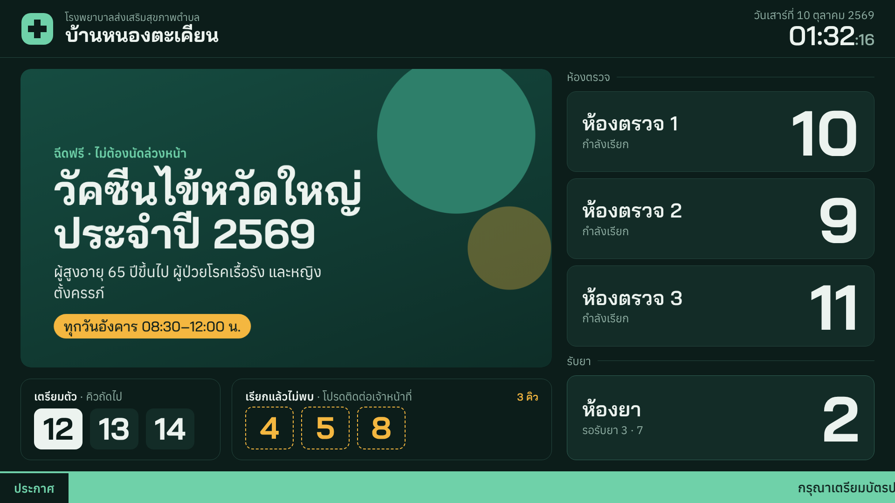
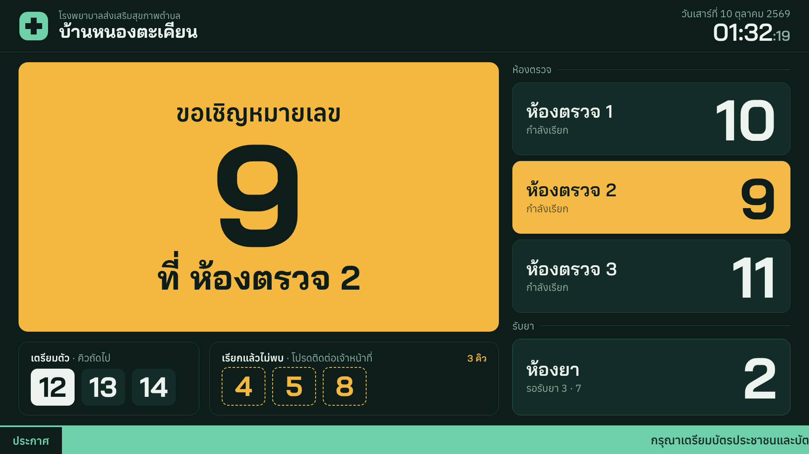
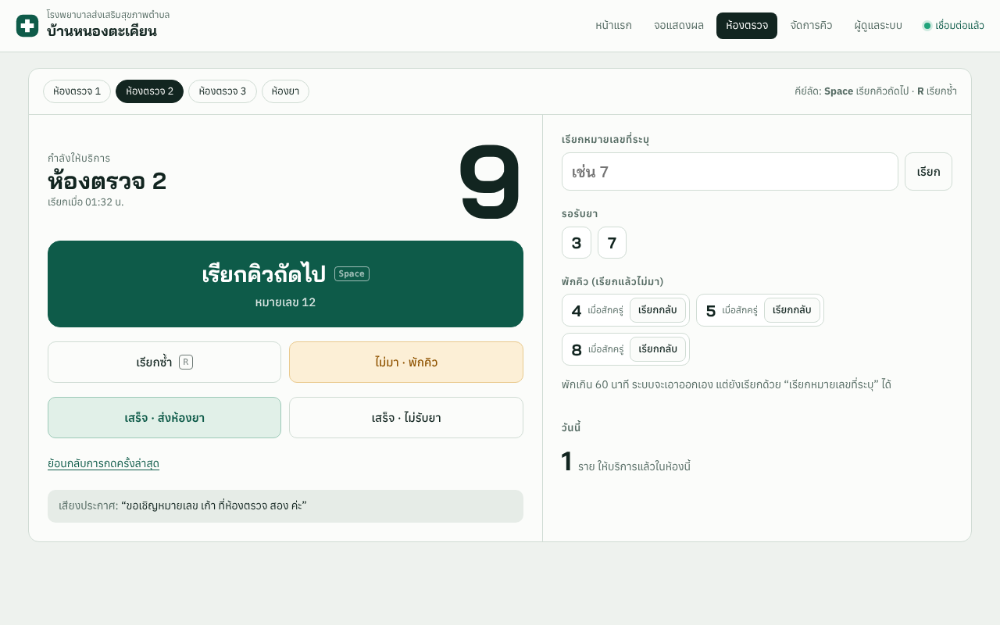
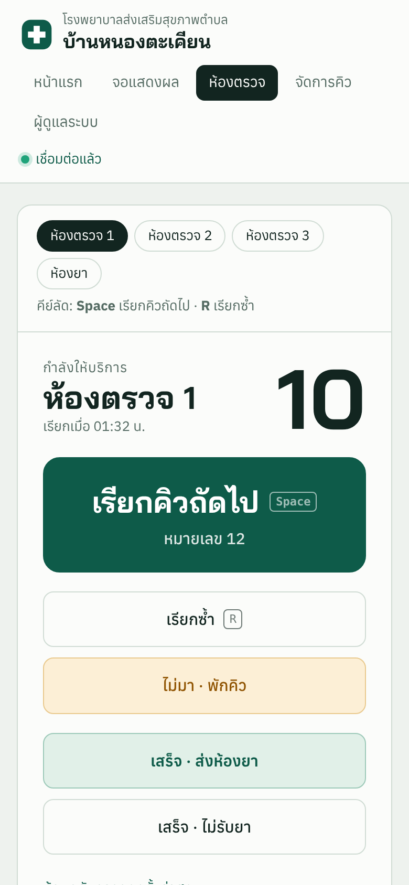
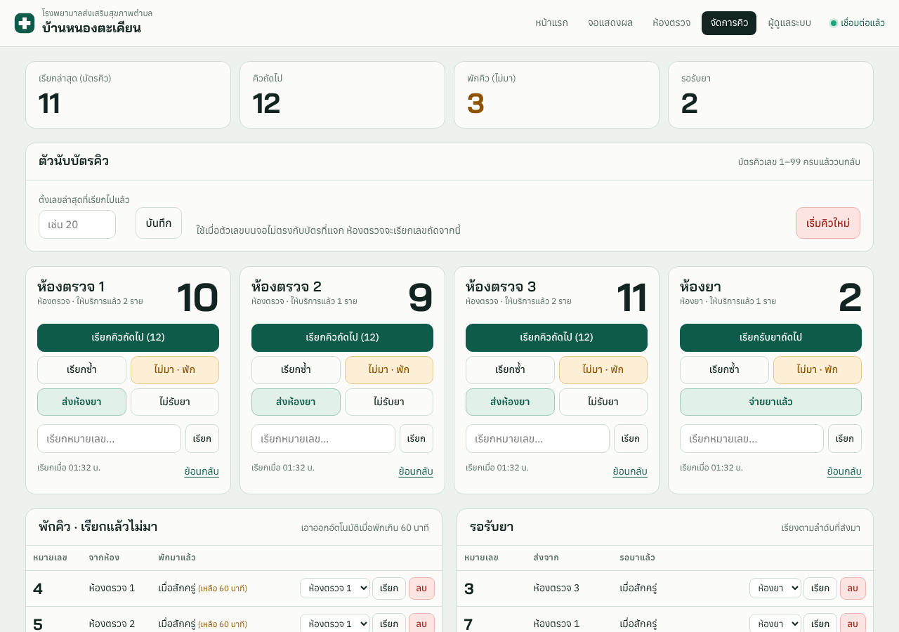
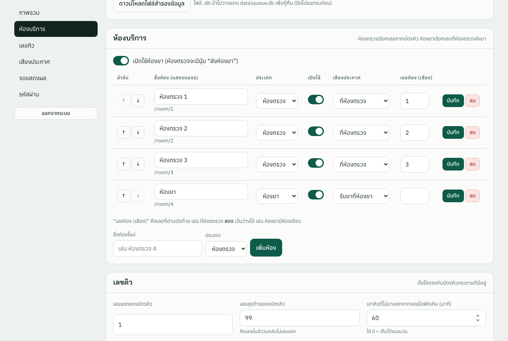

# SHPH Queue · ระบบเรียกคิว รพ.สต.

ระบบเรียกคิวคนไข้สำหรับโรงพยาบาลส่งเสริมสุขภาพตำบล (รพ.สต.) ใช้งานคู่กับ**บัตรคิวกระดาษที่มีอยู่แล้ว** ห้องตรวจกดเรียกคิวจากหน้าเว็บ จอทีวีจะขึ้นเลขพร้อมเสียงประกาศภาษาไทย และระหว่างรอก็เปิดสื่อประชาสัมพันธ์ได้



- **ติดตั้งง่าย** ใช้ไฟล์ `shph-queue.exe` ไฟล์เดียวบน PC เครื่องหนึ่ง ไม่ต้องลงฐานข้อมูลหรือโปรแกรมอื่นเพิ่ม
- **เครื่องอื่นแค่เปิดเบราว์เซอร์** ทั้ง PC ในห้องตรวจ ห้องยา และจอทีวี เข้าผ่านวง LAN เดียวกัน
- **ข้อมูลไม่หาย** ถ้าปิดโปรแกรมหรือไฟดับ เปิดใหม่แล้วคิวต่อจากเดิม
- **ทุกจอเปลี่ยนตามกันทันที** กดที่ห้องไหน จอทีวีก็ขึ้นภายในเสี้ยววินาที

> สถานะ: เวอร์ชัน 0.1.0 ผ่านการทดสอบอัตโนมัติและทดสอบในเบราว์เซอร์แล้ว แต่ยังไม่ได้ลองกับเครื่องจริงที่ รพ.สต. ดูรายละเอียดใน [CHANGELOG.md](CHANGELOG.md)

---

## ทำอะไรได้บ้าง

### 1. จอแสดงผลสำหรับคนไข้ (`/display`)



- แสดงเลขที่กำลังเรียกของทุกห้อง แยกกลุ่มห้องตรวจกับห้องยา
- เมื่อมีการเรียก ช่องสื่อจะเปลี่ยนเป็นป้ายใหญ่ "ขอเชิญหมายเลข 9 ที่ ห้องตรวจ 2" และการ์ดของห้องนั้นเปลี่ยนเป็นสีเหลืองกะพริบ
- **เสียงประกาศภาษาไทย เสียงผู้หญิง** เช่น "ขอเชิญหมายเลข **สิบสอง** ที่ห้องตรวจ **สอง** ค่ะ" ตั้งได้ว่าจะประกาศซ้ำกี่รอบ
- **เตรียมตัว** แสดงเลขที่จะถูกเรียกถัดไป คนไข้จะได้เตรียมตัวก่อน
- **เรียกแล้วไม่พบ** แสดงเลขที่เรียกแล้วคนไข้ไม่อยู่ หน้าละ 5 เลข ถ้ามีมากกว่านั้นจอพลิกหน้าเอง
- **สื่อประชาสัมพันธ์** เล่น YouTube (วิดีโอหรือ Playlist) ไฟล์วิดีโอ และรูปภาพวนกัน ระหว่างประกาศเสียงจะเบาเสียงสื่อลงให้เอง
- ข้อความวิ่งด้านล่าง วันที่ และนาฬิกา
- ออกแบบสำหรับทีวี 1920×1080 และปรับขนาดตามจอได้เอง

### 2. หน้าห้องตรวจ / ห้องยา (`/room/1`, `/room/2`, …)

<p>
  
  
</p>

- ปุ่มใหญ่ **เรียกคิวถัดไป** จะได้เลขถัดไปจากบัตรคิวทันที ห้องไหนว่างก็กดเรียกได้
- **เรียกซ้ำ** และ **ไม่มา · พักคิว**
- จบคิวได้ 2 แบบ คือ **เสร็จ · ส่งห้องยา** และ **เสร็จ · ไม่รับยา**
- **เรียกหมายเลขที่ระบุ** และ **เรียกกลับ** จากรายการพักคิว
- **ย้อนกลับ** ถ้ากดผิด ย้อนได้ 10 ครั้งล่าสุด
- คีย์ลัด `Space` เรียกคิวถัดไป และ `R` เรียกซ้ำ
- ห้องยาใช้หน้าเดียวกัน แต่เรียกจากรายการคิวที่ห้องตรวจส่งมา
- ใช้บนมือถือหรือแท็บเล็ตได้ด้วย

### 3. หน้าจัดการคิว (`/manage`)



สำหรับเจ้าหน้าที่ที่ดูแลภาพรวม ใช้แก้ไขได้ทุกห้องจากหน้าเดียว:
- กดเรียก เรียกซ้ำ พักคิว หรือจบคิว แทนห้องไหนก็ได้
- รายการพักคิว: เลือกห้องแล้วเรียกเข้า หรือลบออก พร้อมแสดงเวลาที่เหลือก่อนระบบเอาออกเอง
- รายการรอรับยา: เรียกเข้าห้องยา หรือลบออก
- **ตั้งเลขล่าสุด** เมื่อเลขบนจอไม่ตรงกับบัตรที่แจกไป และ **เริ่มคิวใหม่**
- บันทึกการทำงานของวันนี้ ดูได้ว่าใครเรียกเลขอะไร ตอนไหน

### 4. หน้าผู้ดูแลระบบ (`/admin`)



ต้องใส่รหัสผ่านก่อนเข้า ตั้งค่าได้ทั้งหมดโดยไม่ต้องแก้โค้ด:
- **ห้องบริการ** เพิ่ม ลบ เรียงลำดับ เปิด/ปิดแต่ละห้อง และเลือกคำที่ใช้ประกาศ เช่น "ที่ห้องตรวจ", "ที่ห้องทันตกรรม"
- **เปิด/ปิดห้องยา** ถ้าปิด ห้องตรวจจะเหลือปุ่ม "เสร็จสิ้น" ปุ่มเดียว
- **เลขคิว** ช่วงเลขบัตร (ค่าเริ่มต้น 1–99 แล้ววนกลับ), จำนวนนาทีก่อนเอาคิวที่ไม่มาออกจากจอ (ค่าเริ่มต้น 60), และเริ่มคิวใหม่อัตโนมัติทุกวัน
- **เสียงประกาศ** จำนวนรอบ ช่วงเว้น ความดัง เสียงกริ่ง ปุ่มทดสอบเสียง และอัปโหลดไฟล์เสียงที่อัดเอง
- **จอแสดงผล** ชื่อหน่วยงาน ข้อความวิ่ง และรายการสื่อประชาสัมพันธ์ (อัปโหลดรูปหรือวิดีโอ หรือใส่ลิงก์ YouTube)
- **ภาพรวม** สถิติวันนี้ อุปกรณ์ที่เชื่อมต่ออยู่ ที่อยู่สำหรับเปิดจากเครื่องอื่น และปุ่มดาวน์โหลดไฟล์สำรองข้อมูล

---

## ระบบทำงานอย่างไร

```
            ┌──────────────────────────────┐
            │ PC เครื่องแม่ข่าย (Windows)    │
            │ shph-queue.exe + data\       │
            └──────────────┬───────────────┘
                           │ วง LAN / Wi-Fi
   ┌───────────────┬───────┴───────┬───────────────┬──────────────┐
 จอทีวี          ห้องตรวจ 1–3       ห้องยา          จัดการคิว        ผู้ดูแลระบบ
 /display        /room/1–3        /room/4         /manage        /admin
```

**การไหลของคิว:**

1. คนไข้หยิบบัตรคิวกระดาษ
2. ห้องตรวจที่ว่างกด "เรียกคิวถัดไป" ระบบใช้ตัวนับกลางตัวเดียว ทุกห้องจึงเรียงเลขต่อกัน
3. ห้องตรวจกด "เสร็จ · ส่งห้องยา" หรือ "เสร็จ · ไม่รับยา"
4. ห้องยาเรียกเลขจากคิวรอรับยา แล้วกด "จ่ายยาแล้ว"

ถ้าคนไข้ไม่มา ให้กด "ไม่มา · พักคิว" เลขจะไปขึ้นในช่อง "เรียกแล้วไม่พบ" จนกว่าจะเรียกกลับ หรือจนครบเวลาที่ตั้งไว้

## ความต้องการของระบบ

| อุปกรณ์ | ต้องการ |
|---|---|
| เครื่องแม่ข่าย | Windows 10/11 64-bit ใช้ทรัพยากรน้อย (โปรแกรมขนาดประมาณ 5 MB) ควรตั้ง IP ให้คงที่ |
| เครื่องในห้อง | เบราว์เซอร์ทั่วไป (Chrome, Edge) ต่อวง LAN เดียวกัน |
| จอทีวี | Google TV / Android TV ติดตั้ง Fully Kiosk Browser หรือ PC ต่อจอ ถ้าจะเปิด YouTube ต้องต่ออินเทอร์เน็ต |

---

## ติดตั้งบน Windows

1. ดาวน์โหลด `SHPH-Queue-windows.zip` จากหน้า **Releases** หรือจาก build ล่าสุดในแท็บ **Actions**
2. แตกไฟล์ไว้ในโฟลเดอร์ที่ไม่ย้ายไปไหน เช่น `C:\SHPH-Queue` แล้วดับเบิลคลิก `shph-queue.exe`
3. เมื่อ Windows ถามเรื่อง Firewall ให้อนุญาต **Private networks**
4. หน้าต่างโปรแกรมจะแสดงที่อยู่ เช่น `http://192.168.1.10:8000` นำไปเปิดที่เครื่องอื่น
5. เข้า `/admin` (รหัสผ่านเริ่มต้น `admin`) แล้ว**เปลี่ยนรหัสผ่าน** ตั้งชื่อ รพ.สต. และตั้งเลขคิวให้ตรงกับบัตรกระดาษ

ใน zip มีไฟล์ช่วยเหลือ:
- `install-autostart.bat` ให้โปรแกรมเปิดเองเมื่อเปิดเครื่อง (`uninstall-autostart.bat` ใช้ยกเลิก)
- `open-firewall.bat` คลิกขวาแล้วเลือก Run as administrator ใช้เมื่อเครื่องอื่นเข้าไม่ได้
- เปลี่ยนพอร์ตได้ด้วย `shph-queue.exe --port 8080`

### ตั้งค่าจอทีวี Google TV

Google TV ไม่มี Chrome มาให้ แนะนำให้ติดตั้ง **Fully Kiosk Browser** แล้วตั้งค่าดังนี้:
- Start URL: `http://<IP เครื่องแม่ข่าย>:8000/display`
- Web Content Settings: เปิด *Autoplay Videos* และ *Autoplay Audio*
- เปิด *Keep Screen On* และ *Launch on Boot*

ถ้าเบราว์เซอร์ไม่ยอมเล่นเสียงเอง จอจะขึ้นแถบให้แตะหน้าจอหรือกดปุ่ม OK ที่รีโมต 1 ครั้ง ทดสอบเสียงได้จาก `/admin` → ทดสอบเสียง

## เสียงประกาศ

ระบบนำไฟล์เสียงสั้นๆ หลายท่อนมาต่อกันเป็นประโยค และอ่านตัวเลขเป็นคำไทย เช่น 11 = สิบเอ็ด, 21 = ยี่สิบเอ็ด, 101 = หนึ่งร้อยเอ็ด รายการไฟล์ทั้งหมดอยู่ใน `voice/voice_lines.json`:
- `invite` "ขอเชิญหมายเลข"
- `num_1` … `num_99`, `hundred_1` … `hundred_9`, `ed` "เอ็ด"
- `phrase_exam` "ที่ห้องตรวจ", `phrase_pharmacy` "รับยาที่ห้องยา" และวลีอื่น
- `end` "ค่ะ"
- `room_{id}` (ไม่บังคับ) ใช้แทนเสียงชื่อห้องทั้งท่อน

แหล่งไฟล์เสียง:
1. **มากับ repo และชุดติดตั้ง** ไฟล์เสียงผู้หญิง (`th-TH-PremwadeeNeural`) เก็บไว้ในโฟลเดอร์ `voice/` workflow `voice` บน GitHub Actions สร้างให้ด้วย `tools/make_voice.py` ซึ่งใช้เสียงออนไลน์ของ Microsoft Edge ผ่านแพ็กเกจ `edge-tts` (ไม่ใช่ API ทางการ) เมื่อแก้ `voice/voice_lines.json` ระบบจะสร้างเฉพาะไฟล์ที่ยังไม่มีแล้ว commit ให้เอง
2. **สร้างเอง** บนเครื่องที่มีอินเทอร์เน็ต: `pip install edge-tts` แล้วรัน `python tools/make_voice.py`
3. **อัดเสียงเจ้าหน้าที่เอง** ตั้งชื่อไฟล์ตามรายการ แล้วอัปโหลดในหน้า `/admin` → ไฟล์เสียง

ถ้าไฟล์เสียงไม่ครบ จอจะใช้เสียงอ่านภาษาไทยของเบราว์เซอร์แทน (ถ้าเครื่องนั้นมีเสียงไทย) ถ้าไม่มี จะได้ยินแค่เสียงกริ่ง

## สำรองและกู้คืนข้อมูล

- สำรอง: `/admin` → ดาวน์โหลดไฟล์สำรองข้อมูล จะได้ไฟล์ `.db`
- กู้คืน: ปิดโปรแกรม แล้วนำไฟล์ `.db` ไปวางแทน `data\queue.db`

---

## สำหรับนักพัฒนา

เขียนด้วย Rust (Axum, Tokio, SQLite ผ่าน rusqlite) ส่วนหน้าเว็บเป็น HTML/CSS/JS ธรรมดา ฝังอยู่ใน `.exe` ตอน build

```bash
cargo run -- --dir ./dev-data          # เปิดที่ http://localhost:8000
cargo test                             # unit test + API test (เปิด server จริงทดสอบทุกปุ่ม)
pytest tests/e2e                       # browser test ทั้ง 4 หน้า (ต้อง cargo build และติดตั้ง pytest, playwright ก่อน)
cargo build --release                  # ได้ target/release/shph-queue(.exe)
```

```
src/
  main.rs     เส้นทาง URL, WebSocket, งานเบื้องหลัง (เริ่มวันใหม่, ล้างพักคิว)
  app.rs      สถานะกลาง, บันทึกลงฐานข้อมูล, สร้างข้อความประกาศ
  queue.rs    ตรรกะคิวทั้งหมด + ย้อนกลับ + unit tests
  api.rs      HTTP API, ล็อกอินผู้ดูแล, อัปโหลดไฟล์
  db.rs       SQLite
  model.rs    โครงสร้างข้อมูลและค่าตั้งต้น
  thai.rs     อ่านตัวเลขเป็นคำไทย
web/          หน้าเว็บทั้งหมด
voice/        รายการไฟล์เสียง + ไฟล์เสียง .mp3
tests/        API test (Rust) และ browser test (Playwright)
tools/        สคริปต์สร้างไฟล์เสียง
packaging/    ไฟล์ .bat และคู่มือสำหรับชุดติดตั้ง Windows
docs/         ภาพหน้าจอสำหรับ README
```

ดูเพิ่มเติม:
- [CLAUDE.md](CLAUDE.md) การตัดสินใจในการออกแบบ วิธีทดสอบ และขั้นตอนออก release
- [CHANGELOG.md](CHANGELOG.md) บันทึกการเปลี่ยนแปลงแต่ละเวอร์ชัน

ทุกครั้งที่ push ขึ้น GitHub, GitHub Actions จะตรวจรูปแบบโค้ด รัน test ทั้งหมด (รวม browser test) แล้ว build บน Windows, สร้างไฟล์เสียง แล้วแพ็กเป็น zip ถ้า push tag `v*` จะแนบ zip ไว้ที่หน้า Releases ด้วย

## เครดิต

ฟอนต์ Anuphan และ Bai Jamjuree โดย Cadson Demak ใช้สัญญาอนุญาต SIL Open Font License 1.1

ภาพหน้าจอใน README ใช้ข้อมูลตัวอย่าง ชื่อหน่วยงานและข้อความประชาสัมพันธ์เป็นข้อมูลสมมติ
